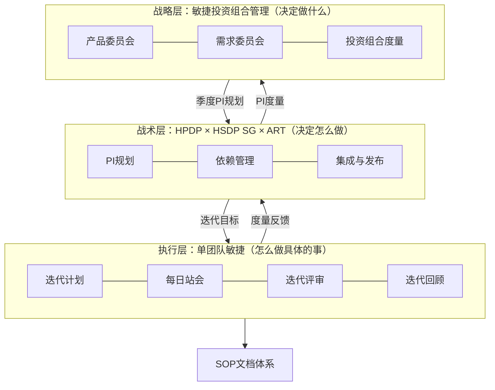
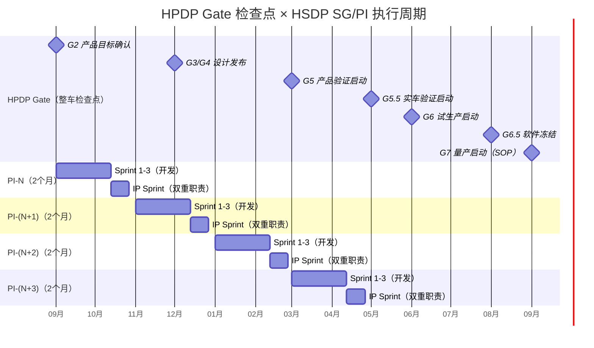

# 论述题：结合业务实际，梳理并沉淀一套适配业务的敏捷迭代方法论，输出标准化文档

---

## 一、业务痛点分析：车载软硬耦合与多团队协同的核心挑战

在汽车座舱研发场景中，敏捷迭代面临以下区别于互联网行业的特有痛点：

| 痛点 | 具体表现 | 根因 |
|------|---------|------|
| **软硬耦合刚性约束** | 软件交付必须与整车造车节点（OTS/TTO/PP/SOP）严格对齐，错过节点意味着整车项目delay | 整车IPD流程（HPDP G0-G8）对软件交付形成外部刚性约束，软件版本释放时间不得晚于整车Gate所需时间 |
| **多团队大规模协同** | 31个战队并行开发，跨域依赖（OS/Apps/Cloud三域）频繁，协调成本随团队规模指数上升 | 缺乏系统化的依赖登记、跟踪与仲裁机制，依赖发现滞后 |
| **版本固定不可逆** | 造车版本SW版本号与整车节点刚性绑定，一旦释放不可随意回退 | 版本发布策略（FOTA/SOTA/Hotfix）与造车节点强关联，版本号区间与节点强绑定 |
| **需求准入无序** | 魅点需求约占30%，无结构化准入机制，迭代中需求变更率曾高达30%+ | 缺乏跨平台优先级裁决机制，需求涌入不受控 |
| **跨ART资源竞争** | 多ART并行开发，资源争抢无仲裁，非核心需求挤占核心需求开发资源 | 缺乏投资组合层面的优先级管理，战略方向与资源配置脱节 |
| **流程与执行脱节** | 有流程文档但无人遵守，仪式走过场，改进闭环缺失 | 流程设计脱离业务实际，缺乏可落地的SOP和度量反馈 |

---

## 二、敏捷流程体系总体架构

针对上述痛点，构建"战略层→战术层→执行层"三层敏捷流程体系：



**三层关系**：战略层决定"做什么"（投资方向、优先级裁决），战术层负责"怎么做"（执行节奏、质量门禁、跨团队协同），执行层负责"具体做"（单团队迭代执行与持续改进）。三层通过PI规划、迭代目标和度量反馈形成闭环。

---

## 三、战略层：敏捷投资组合管理

### 3.1 为什么需要投资组合管理

31个战队并行开发、多ART并行运行的规模下，仅靠迭代级管理已无法解决以下战略层问题：

- **需求准入无序**：魅点需求约占30%，无结构化准入，跨ART优先级无人裁决
- **跨ART资源竞争**：多ART资源争抢无仲裁，非核心需求挤占核心需求开发资源
- **投资方向错配**：造车版本与整车节点刚性绑定，但投资方向与交付能力脱节

### 3.2 三层投资组合治理

| 层级 | 职责 | 会议节奏 | 解决什么问题 |
|------|------|---------|------------|
| **战略层**（产品委员会） | 跨ART投资方向、预算分配、战略主题 | 季度 | 魅点需求无序涌入 |
| **项目层**（ART铁三角） | PI目标、需求优先级、资源调配 | 双周 | ART间资源竞争 |
| **执行层**（战队） | 迭代目标、技术实现、质量保障 | 双周 | 迭代内执行偏差 |

### 3.3 需求优先级排序机制

四级需求分类模型：

| 类型 | 定义 | 占比目标 | 决策权 |
|------|------|---------|--------|
| 核心需求 | 车型必装功能，缺失导致不可交付 | ≥50% | 产品委员会 |
| 使能需求 | 支撑核心功能的技术基建 | 20-25% | 技术委员会 |
| 优化需求 | 体验改进、性能优化 | 15-20% | ART产品经理 |
| 魅点需求 | 差异化亮点，非必须 | ≤10% | 产品委员会+高管 |

WSJF快速优先级裁判框架：

```
WSJF = (用户价值 + 时间价值 + 风险降低/机会促成) / 故事点估算
```

每季度PI规划前完成一次全量WSJF排序。

---

## 四、战术层：HPDP × HSDP SG × ART

### 4.1 三层融合框架

核心设计思路：将整车产品开发流程（HPDP）、软件执行门禁（HSDP SG）与敏捷发布火车（ART）三层融合，实现"外部刚性节点驱动内部迭代节奏"。



**三层关系要点**：

- HPDP Gate是整车OEM侧的刚性节点，软件交付必须满足对应Gate的准出要求
- HSDP SG（SG0-SG4）是PI内部门禁。SG0→SG1→SG2在**上一个PI的IP Sprint**期间执行，SG3→SG4在当前PI的IP Sprint期间执行
- ART以HSDP SG为执行节奏，SG3=Feature Complete，SG4=Regression Complete

### 4.2 跨团队依赖管理SOP（三段式）

| 阶段 | 动作 | 工具 | 责任人 |
|------|------|------|--------|
| **登记** | 需求准入时，战队长识别全部外部依赖，登记至依赖跟踪表 | 依赖跟踪表（AI表格） | 战队长 |
| **跟踪** | 每周依赖同步会，更新依赖状态（绿色/黄色/红色） | 依赖看板 | STE |
| **仲裁** | 红色依赖升级至产品委员会，48小时内给出仲裁结论 | 升级机制 | 产品委员会 |

---

## 五、执行层：单团队敏捷

### 5.1 双周迭代节奏

| 参数 | 值 | 说明 |
|------|----|------|
| Sprint时长 | 2周 | 固定节奏，绝不改期 |
| PI组成 | 4个Sprint（约2个月） | 3个开发Sprint + 1个IP Sprint |
| IP Sprint | PI最后1个Sprint | 双重职责：当前PI的SG3→SG4 + 下个PI的SG0→SG1→SG2 |

**关键迭代事件**：

| 事件 | 时机 | 目的 |
|------|------|------|
| 迭代指引会 | 启动前一周 | 需求澄清与下迭代准备 |
| 迭代计划会（1+2轮） | 启动周 | 充分细化与承诺 |
| 需求冻结 | 启动日早9点 | 锁定范围，保护专注时间窗 |
| 提测冻结 | 开发中期 | 控制测试入口 |
| 版本释放 | 迭代末 | 成果发布 |
| 迭代评审会 | 迭代结束 | 演示价值 |
| 迭代回顾会 | 迭代结束 | 复盘改进 |

### 5.2 迭代复盘优化闭环（双PDCA循环）

**内圈：团队级Scrum事件**

```
迭代计划 → 每日站会 → 开发执行 → 迭代评审 → 迭代回顾 → 改进项跟踪 → 下一迭代
```

**迭代回顾会设计**（4L回顾法）：

| 步骤 | 内容 | 时间 |
|------|------|------|
| Liked（喜欢） | 本迭代做得好的，值得保持 | 15min |
| Learned（学到） | 本迭代学到的新知识/技能 | 15min |
| Lacked（缺乏） | 本迭代缺失的，需要补充的 | 15min |
| Longed For（渴望） | 团队希望未来改进的方向 | 15min |

**改进项跟踪机制**：

- 每次回顾会输出3-5个改进项，登记至改进Backlog
- 改进项指定负责人和截止日期
- 下次回顾会首项议程：检查上次改进项完成情况
- 目标：改进项关闭率≥90%

**外圈：价值流团队同步事件**

```
季度规划 → 月度系统演示 → 季度回顾
```

| 耦合点 | 频率 | 连接内容 |
|--------|------|---------|
| 迭代指引 | 每迭代 | 外圈需求优先级传递至内圈 |
| 问题点检进度同步 | 每周 | 阻塞性问题跨团队同步 |
| 平台晚会 | 每日 | 跨ART技术协调 |
| 项目周会 | 每周 | 项目级进展与风险同步 |

### 5.3 DoR/DoD定义

**DoR（就绪标准）**：

| 条目 | 验证方式 |
|------|---------|
| 需求有明确的业务价值描述 | 产品经理确认 |
| 验收条件已定义（Checklist格式） | 产品经理确认 |
| UI/UE设计稿已评审通过 | 设计评审记录 |
| 技术可行性已评估 | TL确认 |
| 外部依赖已登记 | 依赖跟踪表 |
| 需求规模可估算（≤13 story points） | 战队估算 |

**DoD（完成标准）**：

| 条目 | 验证方式 |
|------|---------|
| 代码已通过Code Review | PR合并记录 |
| 单元测试覆盖率≥80% | CI报告 |
| 功能测试用例全部通过 | 测试报告 |
| 无P0/P1缺陷未关闭 | 缺陷跟踪表 |
| 接口文档已更新 | 文档评审 |
| 已部署至集成环境并通过冒烟测试 | CI/CD流水线 |

---

## 六、规范层：SOP文档体系

### 6.1 文档体系架构

```
docs/
├── 01-流程规范/              # 流程定义层
│   ├── 迭代管理SOP.md        # 迭代全生命周期操作规程
│   ├── 需求准入SOP.md        # 需求准入与优先级排序规程
│   ├── 依赖管理SOP.md        # 跨团队依赖管理规程
│   ├── 版本发布SOP.md        # 版本发布与基线管理规程
│   └── 质量门禁SOP.md        # DoR/DoD定义与检查规程
│
├── 02-模板/                  # 可复用模板层
│   ├── PI规划会议议程模板.md
│   ├── 迭代计划会模板.md
│   ├── 迭代评审会模板.md
│   ├── 迭代回顾会模板.md
│   ├── 需求卡片模板.md
│   └── 依赖登记表模板.md
│
├── 03-度量/                  # 度量定义层
│   ├── 迭代度量指标定义.md
│   ├── PI级度量指标定义.md
│   └── 仪表板设计规范.md
│
└── 04-培训/                  # 培训材料层
    ├── 敏捷基础培训.md
    ├── 角色职责手册.md
    └── 工具使用指南.md
```

### 6.2 核心SOP模板：迭代管理SOP

| 阶段 | 时间 | 输入 | 活动 | 输出 | 参与角色 | 质量门禁 |
|------|------|------|------|------|---------|---------|
| 迭代指引 | T-1周 | 待办需求列表 | 需求澄清、技术可行性评估 | 就绪需求列表 | PO+TL | DoR检查 |
| 计划会I | T周一 | 就绪需求列表 | 需求讲解、任务拆分 | 初步承诺 | PO+战队全员 | 需求冻结 |
| 计划会II | T周二 | 初步承诺 | 细化任务、排期确认 | 迭代Backlog | 战队全员 | 排期确认 |
| 开发执行 | T+1~3周 | 迭代Backlog | 开发、自测、联调 | 可提测代码 | 开发人员 | 提测冻结 |
| 提测冻结 | T+3周 | 可提测代码 | 测试入口控制 | 测试基线 | TO | 提测DoD |
| 评审会 | T末 | 完成的功能 | 演示、反馈收集 | 评审结论 | PO+战队+干系人 | 功能完成 |
| 回顾会 | T末 | 迭代数据 | 复盘、改进项识别 | 改进Backlog | 战队全员 | 改进项登记 |

---

## 七、度量体系

### 7.1 迭代级度量（团队自改进用）

| 指标 | 定义 | 目标 | 说明 |
|------|------|------|------|
| 迭代完成率 | 完成Story Points / 计划Story Points | ≥80% | 先行指标 |
| 需求变更率 | 迭代内变更需求数 / 总需求数 | ≤10% | 已验证<8% |
| 缺陷逃逸率 | 线上缺陷 / 总缺陷 | ≤5% | 质量指标 |
| 技术债务偿还率 | 已偿还技术债务 / 计划偿还 | ≥70% | 已验证 |

### 7.2 PI级度量（管理层用）

| 指标 | 定义 | 目标 |
|------|------|------|
| Flow Velocity | PI内交付Story Points总量 | 持续提升 |
| Flow Time | 需求从准入到交付的平均天数 | 持续缩短 |
| Flow Efficiency | 活跃开发时间 / 总前置时间 | ≥30% |
| 依赖解决率 | 按时解决的依赖 / 总依赖 | ≥90% |

### 7.3 投资组合级度量（战略层用）

| 指标 | 定义 | 用途 |
|------|------|------|
| 投资组合Flow Velocity | 所有ART交付价值总和 | 整体交付能力评估 |
| 战略一致性指数 | 交付内容与战略主题对齐度 | 防止资源分散到非核心需求 |
| 投资回报率 | 交付价值 / 投入成本 | 投资效率评估 |

### 7.4 依赖健康度度量

| 指标 | 定义 | 目标 |
|------|------|------|
| 依赖发现率 | PI启动前已登记的依赖 / 实际总依赖 | ≥80% |
| 依赖解决率 | 按时解决的依赖 / 总依赖 | ≥90% |
| 依赖升级率 | 升级至仲裁的依赖 / 总依赖 | ≤10% |

---

**总结**：本方法论的核心价值在于将汽车行业特有的HPDP整车交付刚性约束、多域多团队大规模协同需求、版本固定不可逆等业务特性，与敏捷投资组合管理（战略层）、HPDP×HSDP SG×ART三层融合框架（战术层）、单团队敏捷迭代（执行层）进行了系统性融合。战略层通过产品委员会和需求准入委员会解决"做什么"的问题，战术层通过三层融合框架和依赖管理SOP解决"怎么做"的问题，执行层通过双周迭代节奏和双PDCA循环解决"具体做"的问题，规范层通过SOP文档体系确保流程可落地，度量体系通过分层指标驱动持续改进。所有设计均基于31个战队的实际验证数据，具备可落地、可复用的特点。
